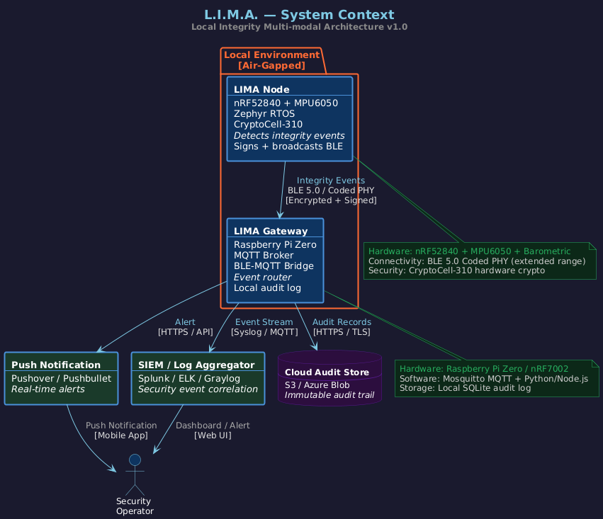
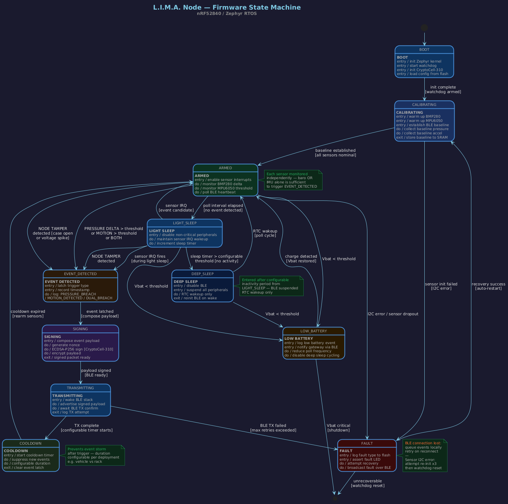
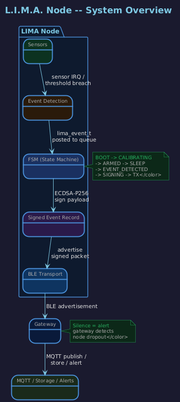

# L.I.M.A. — Local Integrity Multi-modal Architecture

> **A resilient, low-power Physical Intrusion Detection System (PIDS)**  
> Cryptographically signed integrity events from the edge to the operator.

[](https://github.com/jknoxdev/lima-node/actions)
[](LICENSE)
[](https://www.nordicsemi.com/Products/nRF52840)
[](https://developer.nordicsemi.com)
[](#roadmap)


> ⚠️ **Work in Progress**
> ---
> Active development.
>
> Current phase: hardware power management + KiCad schematic.

---



## What is LIMA?
LIMA nodes are small, battery-powered sensors that detect physical integrity events — door opens, enclosure breaches, vehicle towing, cabinet punctures — and deliver cryptographically signed alerts to a local gateway, which routes them to operators via push notification, SIEM, or cloud audit trail.

The system is designed to be **air-gapped first**. No cloud dependency for core operation. No persistent BLE connections. No trusted local network required. Just a node, a gateway, and a signed audit trail that survives internet outages.

---
## Threat Model

LIMA is designed to detect and report physical integrity breaches in
environments where network trust cannot be assumed.

Primary adversary assumptions:

• attacker may have physical access to the protected enclosure  
• attacker may attempt to tamper with sensors or power  
• local network infrastructure may be untrusted or unavailable  
• internet connectivity may be intermittent or intentionally disrupted  

Security goals:

• detect physical intrusion events reliably  
• produce cryptographically verifiable event records  
• preserve a tamper-evident audit trail  
• operate independently of cloud connectivity

---
## Project Status

✔ FSM pipeline validated
✔ CryptoCell ECDSA-P256 signing + AES-256-GCM encryption working
✔ BLE extended advertisement verified
✔ Gateway: BLE scanner + MQTT + SQLite audit log + ntfy.sh notifications
✔ Client: native Rust TUI with live AES-256-GCM decryption

Current phase: hardware power management + KiCad schematic

Released: **v0.1.0** — see [CHANGELOG.md](CHANGELOG.md) for what's included and
what isn't.

---
## Architecture

### System Context


### Node Firmware State Machine


> All diagrams are maintained as PlantUML source in [`docs/architecture/`](docs/architecture/) and auto-rendered to SVG + PNG on every push via GitHub Actions.

---


## System Overview


**Two independent threat models, one pipeline:**

| Trigger           | Use Case                                           | Sensor            |
| -------------------| ----------------------------------------------------| -------------------|
| `PRESSURE_BREACH` | Cabinet puncture, enclosure door open, seal broken | BME280 barometric |
| `MOTION_DETECTED` | Vehicle tow, rack movement, vibration attack       | MPU6050 IMU       |
| `DUAL_BREACH`     | Full physical intrusion — moved AND breached       | Both              |

Each fires independently. An attacker must defeat both sensors simultaneously to avoid detection.

---

## Hardware

| Component   | Part                          | Role                          |
| -------------| -------------------------------| -------------------------------|
| Edge Node   | Nordic nRF52840-DK (PCA10056) | Sensor + crypto + BLE         |
| IMU         | MPU6050                       | Motion / vibration detection  |
| Barometric  | BME280                        | Pressure delta detection      |
| RTC         | DS3231                        | Battery-backed wall clock     |
| Crypto      | CryptoCell-310 (on-die)       | ECDSA-P256 + AES-256-GCM      |
| Gateway     | Raspberry Pi 5                | BLE scanner + MQTT broker     |
| BLE Adapter | ASUS BT500 (Realtek, hci1)    | BLE 5.0 extended adv receiver |

---

## FSM Pipeline Validation


### Completed Milestones
- **FSM:** Full state machine validated — `BOOT → CALIBRATING → ARMED → EVENT_DETECTED → SIGNING → TRANSMITTING → COOLDOWN` end-to-end in ~366µs (stub latency)
- **CryptoCell-310:** Real ECDSA-P256 signing via PSA Crypto — 64-byte signature in ~107ms, hardware accelerated
- **BLE:** Non-connectable advertisement of signed `lima_payload_t` — verified on nRF Connect, `-52 dBm` RSSI
- **Sensors:** MPU6050 IMU + BME280 barometric, independent OR trigger logic, I2C bus recovery on boot
- **Sleep:** `LIGHT_SLEEP → DEEP_SLEEP → RTC wakeup` cycle validated

### Current Phase
Hardware power management + KiCad schematic for production PCB.

---

## Security Design

- **Every event is signed & encrypted** — ECDSA-P256 via CryptoCell-310 hardware accelerator (~50ms, minimal power)
- **Per-event nonce** — prevents replay attacks
- **Tamper events are first-class** — a failed signature verification is itself logged and alerted
- **SQLite written first** — audit trail is intact regardless of internet connectivity
- **Queue-and-flush** — events survive gateway internet outages, delivered on reconnect
- **Air-gapped core** — no cloud dependency for detection, signing, or local audit

---

## Firmware Stack

```
┌──────────────────────────────────┐
│         Application Layer        │
│  Event Aggregator · State Machine│
├──────────────────────────────────┤
│         Zephyr RTOS              │
│  Scheduler · Power Mgmt · DTS    │
├──────────────────────────────────┤
│         Nordic NCS               │
│  BLE Stack · CryptoCell · HAL    │
├──────────────────────────────────┤
│         nRF52840 Hardware        │
│  Cortex-M4F · CryptoCell-310     │
└──────────────────────────────────┘
```

**NCS Version:** v3.2.2 · **Zephyr:** 4.2.99 · **Board:** `nrf52840dk/nrf52840`

---

## Getting Started

See [`docs/build/FLASHING.md`](docs/build/FLASHING.md) for the complete build and flash guide.

```bash
# 1. Initialize workspace
python3 -m venv .venv && source .venv/bin/activate
pip install west
west init -l lima-node
west update

# 2. Install SDK requirements
pip install -r zephyr/scripts/requirements.txt
pip install -r nrf/scripts/requirements.txt

# 3. Build
west build -b nrf52840dk/nrf52840 lima-node/firmware \
  -- -DCONFIG_BUILD_OUTPUT_UF2=y

# 4. Flash (dongle in bootloader mode)
west flash
```

---

## Repository Structure

```
lima-node/
├── firmware/                          # nRF52840 Zephyr firmware
│   ├── src/
│   │   ├── main.c                     # Application entry, sensor poll loop, FSM wiring
│   │   ├── fsm.c / fsm.h              # Full state machine — BOOT → ARMED → SIGNING → TX
│   │   ├── crypto.c / crypto.h        # AES-256-GCM + ECDSA-P256 via CryptoCell-310
│   │   ├── ble.c / ble.h              # BLE 5.0 extended advertising
│   │   ├── rtc.c / rtc.h              # DS3231 RTC — wall clock, tamper detection, wakeup
│   │   └── events.h                   # Event type definitions
│   ├── boards/                        # Board overlays (nRF52840-DK + MDK USB Dongle)
│   ├── tests/sensor_wire/             # I2C sensor validation test
│   ├── tools/provision.py             # PSK + ECDSA key provisioning tool
│   ├── Kconfig                        # LIMA-specific Kconfig symbols
│   └── prj.conf                       # Project configuration
│
├── gateway/                           # Rust gateway workspace (Raspberry Pi 5)
│   └── crates/
│       ├── gateway/src/main.rs        # BLE scanner, sig verify, SQLite, MQTT, TUI
│       ├── lima-types/src/lib.rs      # Wire format constants — single source of truth
│       └── crypto-test/               # Standalone crypto verification utility
│
├── client/                            # Native Rust decrypt client
│   └── src/
│       ├── main.rs                    # PSK prompt, DB poll loop, TUI event loop
│       ├── crypto.rs                  # AES-256-GCM decrypt pipeline + test suite
│       ├── db.rs                      # SQLite read, ack, delete
│       └── display.rs                 # ratatui TUI — decrypted LER display
│
├── docs/
│   ├── architecture/
│   │   ├── adr/                       # Architecture Decision Records (ADR-001 → 006)
│   │   ├── frame-record-spec.md       # LER + LF wire format specification
│   │   ├── *.puml                     # PlantUML source — auto-rendered on push
│   │   └── *.png / *.svg              # Rendered diagrams
│   ├── analysis/threat_model.md       # Threat model
│   ├── verification/                  # FSM, I2C, RF, signal integrity validation notes
│   └── dev/
│       ├── context/                   # Session context files (cross-session handoff)
│       ├── lima-ler-lf-spec.md        # LER/LF spec (dev reference)
│       └── quickref.md                # Build + flash quick reference
│
├── CHANGELOG.md                       # Release history (Keep a Changelog)
├── CONTRIBUTING.md                    # How to contribute + graduation terminology 🎓
├── SECURITY.md                        # Vulnerability disclosure policy
├── COMMERCIAL_LICENSE.md             # Commercial licensing terms
└── west.yml                           # NCS workspace manifest
```


### Highlights

| What                         | Where                                                                                                        |
| ------------------------------| --------------------------------------------------------------------------------------------------------------|
| Wire format spec (LER + LF)  | [`docs/architecture/frame-record-spec.md`](docs/architecture/frame-record-spec.md)                           |
| Encrypt-then-Sign pipeline   | [`firmware/src/crypto.c`](firmware/src/crypto.c)                                                             |
| Wire format constants (Rust) | [`gateway/crates/lima-types/src/lib.rs`](gateway/crates/lima-types/src/lib.rs)                               |
| Gateway BLE → MQTT pipeline  | [`gateway/crates/gateway/src/main.rs`](gateway/crates/gateway/src/main.rs)                                   |
| Client AES-256-GCM decrypt   | [`client/src/crypto.rs`](client/src/crypto.rs)                                                               |
| FSM state machine            | [`firmware/src/fsm.c`](firmware/src/fsm.c)                                                                   |
| ADR-005: Encrypt everything  | [`docs/architecture/adr/ADR-005-encrypt-everything.md`](docs/architecture/adr/ADR-005-encrypt-everything.md) |
| Provisioning tool            | [`firmware/tools/provision.py`](firmware/tools/provision.py)                                                 |

---

## Architecture Decision Records

Major technical decisions are documented in [`docs/architecture/adr/`](docs/architecture/adr/):

| ADR | Decision | Status |
|---|---|---|
| [ADR-001](docs/architecture/adr/ADR-001-nrf52840-selection.md) | nRF52840 over ESP32 / STM32 | Active |
| [ADR-002](docs/architecture/adr/ADR-002-ble-vs-alternatives.md) | BLE 5.0 over Thread / Zigbee / LoRa | Active |
| [ADR-003](docs/architecture/adr/ADR-003-mqtt-vs-alternatives.md) | MQTT over CoAP / raw TCP / HTTP | Active |
| [ADR-004](docs/architecture/adr/ADR-004-zephyr-vs-alternatives.md) | Zephyr RTOS over bare metal / FreeRTOS | Active |
| [ADR-005](docs/architecture/adr/ADR-005-encrypt-everything.md) | AES-256-GCM + ECDSA-P256 on all payloads | Active |
| [ADR-006](docs/architecture/adr/ADR-006-persistent-key-storage.md) | Persistent PSA Key Storage | Active |

---

## Roadmap

- [X] Firmware: IMU + barometric sensor drivers (Zephyr I2C)
- [X] Firmware: Event aggregator with independent OR trigger logic
- [X] Firmware: CryptoCell-310 ECDSA-P256 signing (— ~107ms, hardware accelerated)
- [x] Firmware: CryptoCell-310 AES-256-GCM encryption
- [X] Firmware: BLE advertisement with signed payload — verified on nRF Connect
- [X] Gateway: ~~BlueZ BLE~~ raw HCI scanner + ~~paho~~ rumqttc MQTT publisher
- [X] Gateway: Mosquitto broker + event router 
- [X] Gateway: SQLite audit log + queue-and-flush egress
- [X] Gateway: (Pushover) ntfy.sh push notification handler
- [ ] Hardware: KiCad schematic for production PCB
- [ ] Hardware: Power budget analysis + battery life model
- [ ] Docs: Threat model diagram
- [ ] Docs: Deployment guide

---

## Security
Found a vulnerability? Please review our [Security Policy](SECURITY.md) before opening an issue.

---

L.I.M.A Node firmware is licensed under the GNU Affero General Public
License v3 (AGPLv3). This ensures that improvements remain open and
available to the community, including when used as part of a network service.

### Commercial Licensing

Commercial licenses are required for integration into proprietary,
commercial, industrial, or closed-source systems, platforms, or any
use outside of the AGPLv3 open source terms.

Licensing inquiries: **justin@nullsec.systems**
See [COMMERCIAL_LICENSE.md](COMMERCIAL_LICENSE.md)

---

