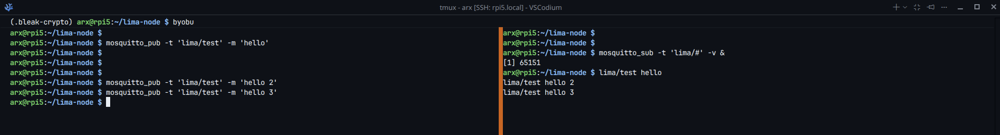
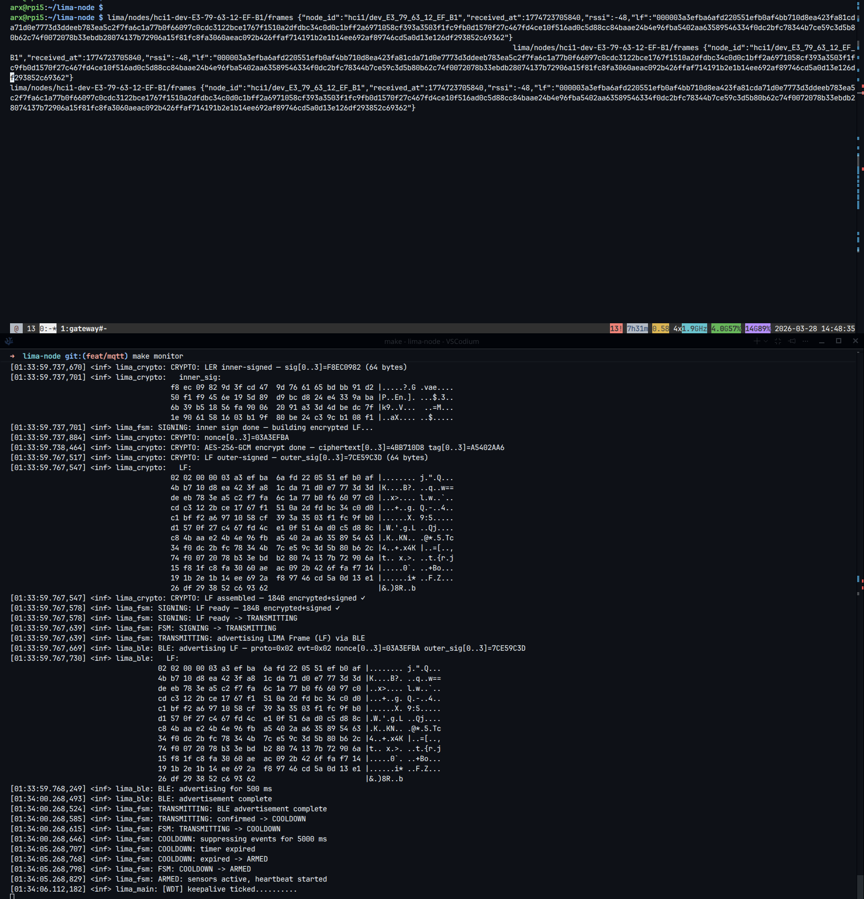

### setup on rpi5

```bash
sudo apt install mosquitto mosquitto-clients -y
sudo systemctl enable mosquitto
sudo systemctl start mosquitto
```

### test

```bash
systemctl status mosquitto

# test:

# seperate system or terminal
mosquitto_sub -t 'lima/#' -v &

# on broker
mosquitto_pub -t 'lima/test' -m 'hello'
```




### local conf
```bash
# add to 
# /etc/mosquitto/conf.d/lima.conf 
allow_anonymous true
listener 1883 localhost
```


> successfull MQTT should look like this: 



### topic schema
```
lima/nodes/{node_id}/frames    # raw verified LF blob (hex), published per frame
lima/nodes/{node_id}/status    # online/offline, published on gateway start/stop
lima/gateway/health            # gateway heartbeat, published every 30s
```

### rationale
MQTT provides a decoupled internal bus between the gateway scanner and consumers
(web client, future dashboards). The gateway publishes verified frames only —
invalid sigs are dropped before reaching the broker. The broker never holds
decryption keys.
