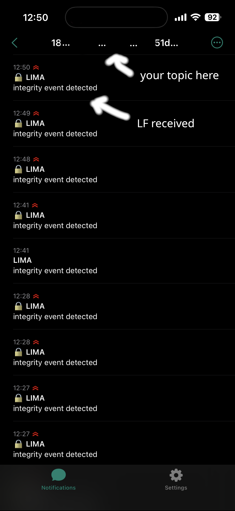

### confirm on gateway
```bash
cat crates/gateway/src/main.rs | grep -n "sig_verified\|ntfy\|MQTT publish" | head -20
```

### setup topic identifier

```bash
# first run
sudo apt install xxd -y

# make dirs
mkdir -p ~/.lima/keys
chmod 700 ~/.lima/keys

# generate a few
for i in {1..32}; do head -c 32 /dev/urandom | xxd -p | tr -d '\n'; echo; done

# copy one of the strings 
# 'a3f7c2e891b4d06f5a2e3c7d1f9b8e42' --> into the echo ''

echo '' > ~/.lima/keys/ntfy_topic

# fix permissions
chmod 600 ~/.lima/keys/ntfy_topic
```

### gen qr-code for phone
```bash
# first run
sudo apt install -y zint

# generate code
zint -b QRCODE --scale=5 \
  -d "ntfy.sh/$(cat ~/.lima/keys/ntfy_topic)" \
  -o ~/.lima/keys/ntfy_topic_qr.png

# fix permissions
chmod 600 ~/.lima/keys/ntfy_topic_qr.png

# open on display
xdg-open ~/.lima/keys/lima-ntfy-qr.png
```

### testing
```bash
# first run
sudo apt install -y jq

# quick
curl -d "integrity event detected" \
  -H "Title: LIMA" \
  https://ntfy.sh/$(cat ~/.lima/keys/ntfy_topic)

# json 
curl -s \
  -H "Title: LIMA" \
  -H "Priority: high" \
  -H "Tags: lock" \
  -d "integrity event detected" \
  https://ntfy.sh/$(cat ~/.lima/keys/ntfy_topic) | jq .

  ```
### verification

should look like this: 



