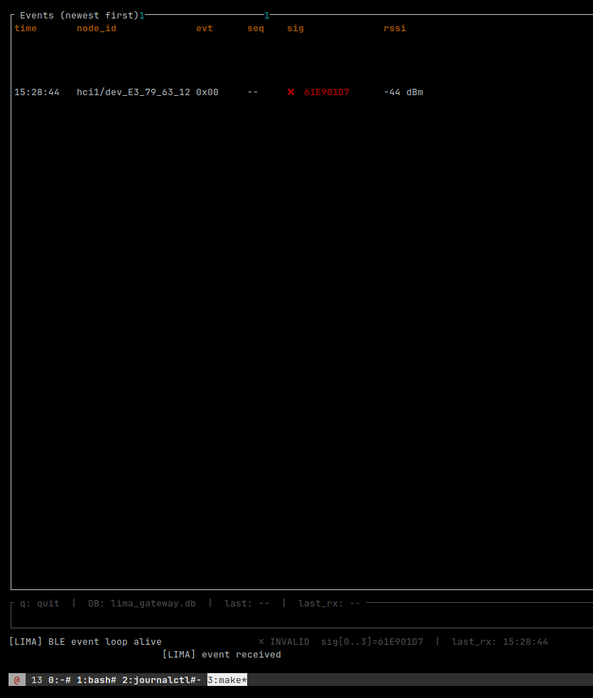
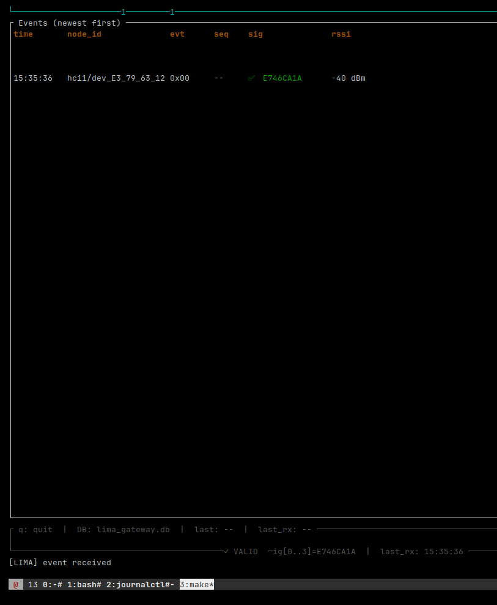

ECDSA-P256 outer signature verification confirmed on live hardware — 2026-04-19
Wrong key (pre-provision): frames received, sig ❌ INVALID, dropped before MQTT

Correct key (post-provision): frames received, sig ✅ VALID, published to MQTT + ntfy
