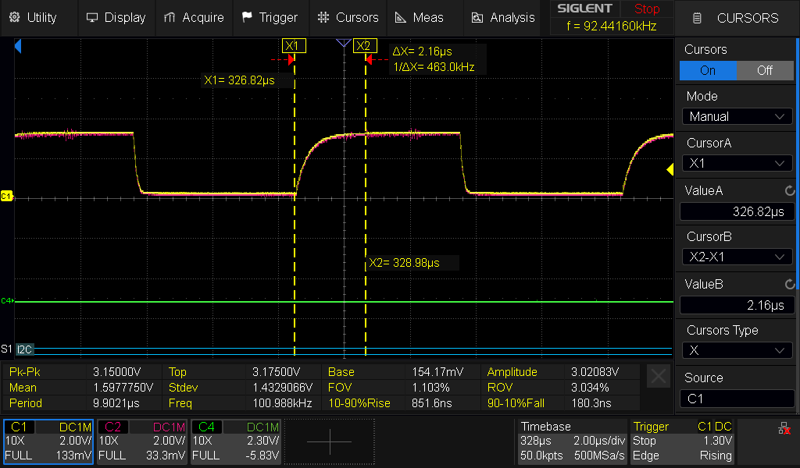
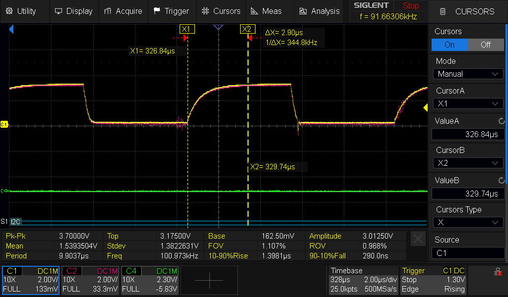

## testing requirements: 
- Validate I2C bus timings using a Siglent SDS804X DSO. 
    - 400kHz clock stability 
    - Wake-on-Motion (WoM) interrupt pulse 
    - Signal from the MPU-6050 meets the minimum 2$\mu$s hold time (required by the nRF52840 GPIO peripheral)
- Validate skew from increased sensor cable length within spec. 
    - original cable < 2ft @ 14 AWG
    
    - new sensor cable @ 6ft w/ 18 AWG (increased noise at approx. 300mv on C2)
     